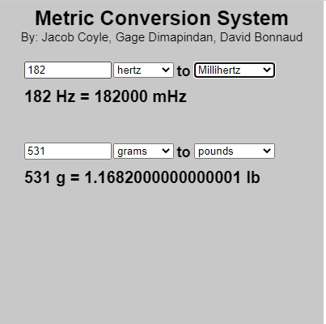
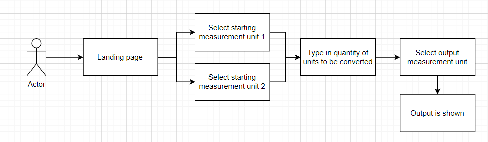

# Metric-Conversion-System
By: Jacob Coyle, Gage Dimapindan, David Bonnaud

This project contains a metric conversion system which can scale various metric using measurements. It also contains some conversions too. This was made in an online JavaScript editor known as p5.js

Install:
1) Download the github repository and extract its content into a folder.
2) Open the folder and click on the file called "index" (this will open up the contents into your default browser)

Alternative Installation:
1) Go to this link - https://editor.p5js.org/jakec903/full/YqLKoBhot
The following contains the code (web browser version) of the generated system
2) Click: Metric Conversion Project copy by jakec903 (this is a bar located above the title, and to the right of the pink p5* box)

3A) Go to "File" and click "Download" from the dropdown menu. This will download a zip file
4A) Extract the contents of the zip file into a place you want to place it.
5A) Go into the file created and click the file called "index"
OR
3B) Create a p5.js online account and logon
4B) Go to "File" and click "save". (The file is saved to your online account and can be accessed going to "File -> Open" and select the file's name (Metric Conversion Project copy)

How to Use:
Insert a number into the input value and also select which units you want to convert. It will display the converted value below (as well as their symbol used).
These values will update as you input different numbers. If you have an invalid input, it will state it.

Additional Information:
Currently this system can only convert: meters, grams, joules, and hertz in the metric scale between values Tera (10e12) and Atto (10e-18)
The conversion also can only convert between: Meters & Feet and Pounds & Grams (and vice versa)

License:
This software is open source and can be modified and used to anyone (MIT)
